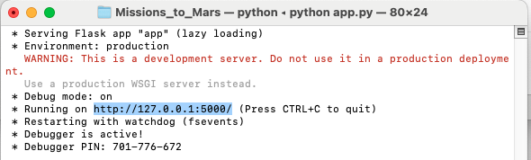
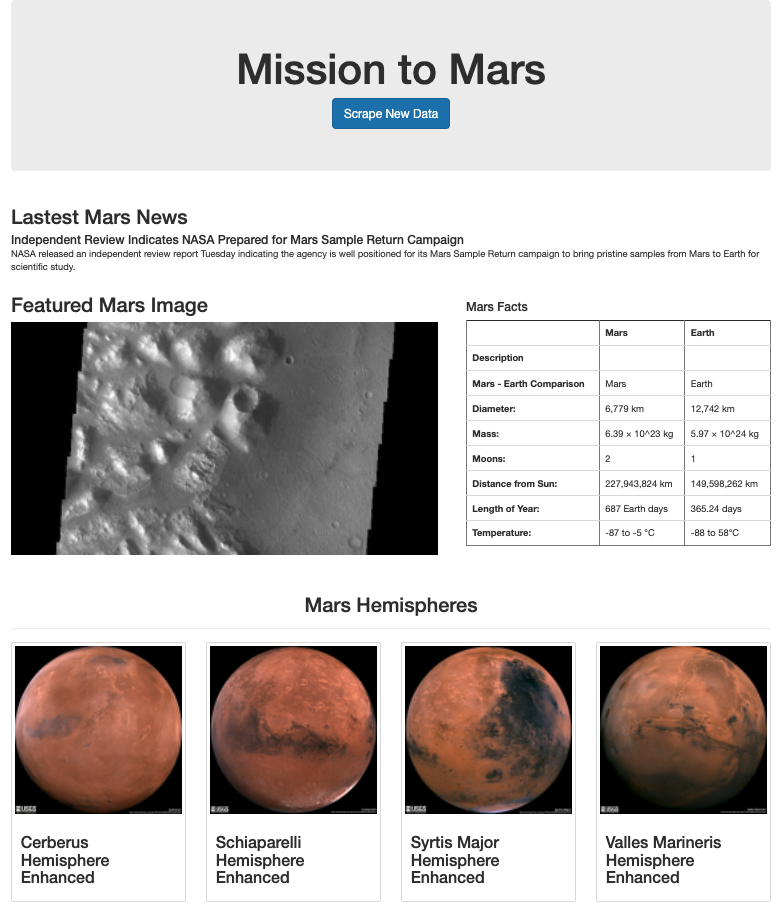

# Mission to Mars: Web Scraping Challenge

Homework for Boot Camp Week 12: Web Scraping and MongoDB; Submitted by Corey Lawson-Enos

## Summary
* Web application that scrapes four websites for current Mars news, facts, and imagery, and displays the information in a single HTML page (see also Sources below.)

## Technologies
HTML, MongoDB, Flask, Jupyter Notebook, BeautifulSoup, Pandas, and Requests/Splinter.

## API Access

* Open app.py file from Terminal/Command Prompt: python app.py
* Copy running URL (screenshot below), paste to browser:

## Landing Preview

## Sources

* Mars Planet Science: https://redplanetscience.com/
* Caltech Jet Propulsion Laboratory Images: https://spaceimages-mars.com/
* Galaxy Facts: https://galaxyfacts-mars.com/
* GUSS Science Center: https://marshemispheres.com/
